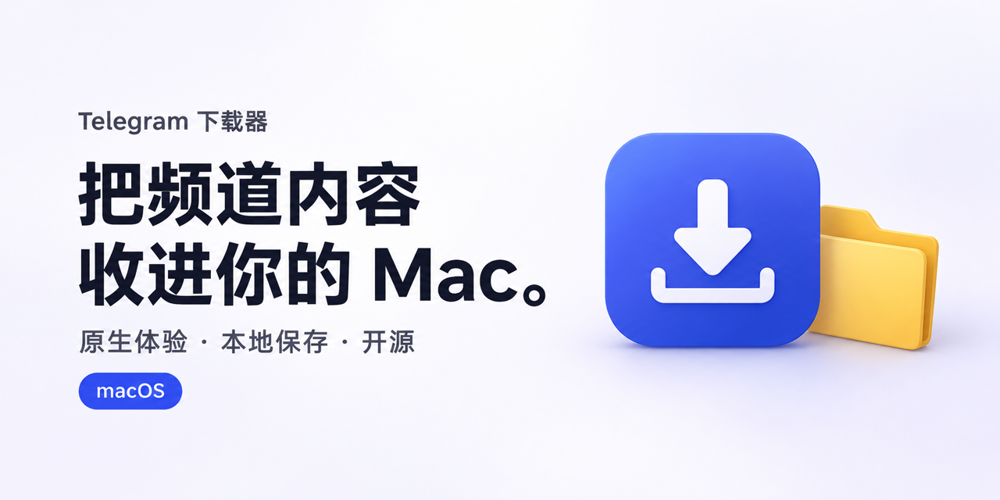
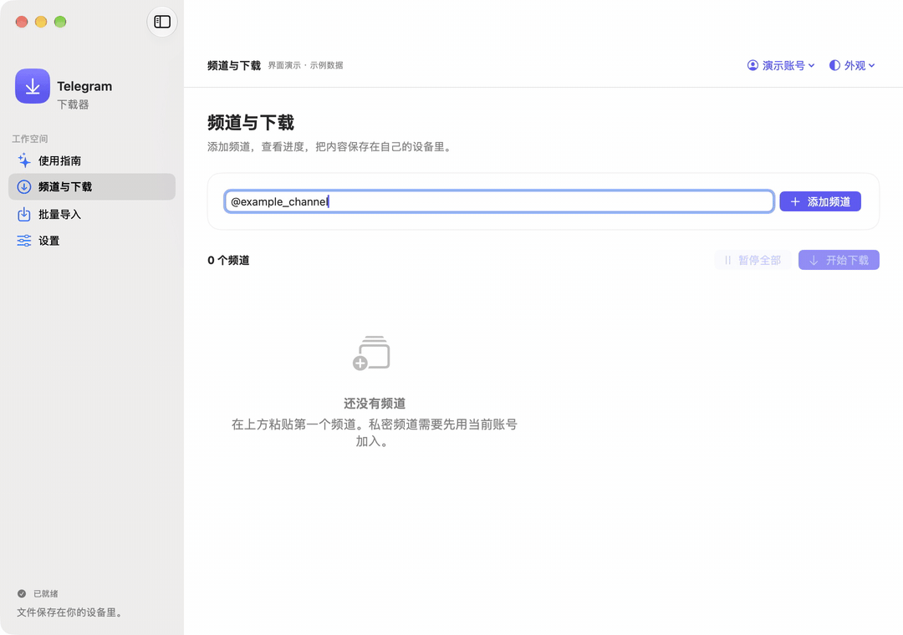
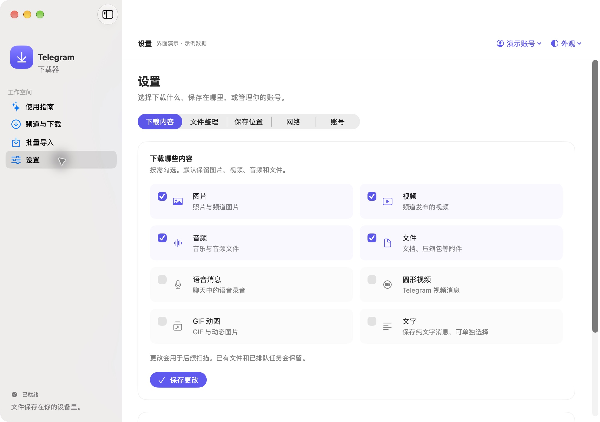

<div align="center">

# Telegram 下载器

**把频道内容，收进你的 Mac。**

原生 macOS 体验，一次配置，按需备份图片、视频、音频、文件与文字。

[](https://github.com/designfuchen/telegram-media-downloader/actions/workflows/checks.yml)
[](LICENSE)
[](https://github.com/designfuchen/telegram-media-downloader/tags)
[](docs/macos.md)

[五步上手](#五步开始第一次下载) · [安装与运行](#安装与运行) · [完整教程](docs/getting-started.md) · [English](README_EN.md)



</div>



<p align="center"><sub>15 秒界面演示 · 虚构频道与示例数据，展示操作流程，不代表实测下载速度。</sub></p>

## 好内容，有自己的归处

不必搭 NAS，也不必为桌面安装包准备 Python。选择一个文件夹，添加频道，剩下的交给下载队列。

| 你想做的事 | 下载器为你准备的功能 |
| --- | --- |
| 第一次用，不知道从哪开始 | 五步引导：API 凭证 → 网络连接 → 登录账号 → 添加频道 → 保存位置与开始 |
| 只保留自己需要的内容 | 图片、视频、音频、文件、语音、圆形视频、GIF 动图与文字分别选择；支持单独保存文字 |
| 节点格式太多，懒得研究 | 一个入口识别分享链接、Clash / Mihomo YAML、JSON 和 Base64 链接列表；保存后测试连接 |
| 一次整理多个频道 | 链接、用户名、频道 ID；文本与 CSV 批量导入，附模板，确认后入库 |
| 想看见下载确实在进行 | 当前传输与整体进度、速度、暂停 / 继续，以及已下载图片和视频的本地缩略图 |
| 不想文件堆成一团 | 按频道、年月、媒体类型整理；选择文件名中保留的消息编号、原文件名和说明 |
| 多个账号各用各的 | 添加、切换与退出账号；各账号拥有独立会话、频道库与下载记录 |
| 中途断网、关闭应用 | 持久化队列、断点恢复、重试退避；再次打开后继续管理任务 |

<details>
<summary><b>看看下载设置</b></summary>



</details>

## 五步开始第一次下载

1. **API 凭证**：打开 [Telegram 官方申请页](https://my.telegram.org/apps)，创建应用，复制 `api_id` 与 `api_hash`。它们是连接凭证，不是机器人 Token。
2. **网络连接**：选择直连，或导入你自己的节点。点击“保存并测试连接”，测试成功后继续。
3. **登录账号**：输入手机号，查看 Telegram 官方消息中的验证码；有两步验证时再输入密码。未收到验证码可按页面提示重新发送。
4. **添加频道**：粘贴 `https://t.me/example_channel`、`@example_channel` 或 `-100` 开头的频道 ID。私密频道先用当前账号加入。
5. **保存位置与开始**：使用 Mac 文件夹选择器选好目录，点击“开始下载”。在“设置”里随时调整下载类型和文件整理方式。

**卡在哪一步，就看哪一步。** [完整图文教程](docs/getting-started.md) 包括 API 表单怎么填、频道 ID 怎么找、验证码与连接问题怎么处理。

## 安装与运行

### Mac 应用

面向 **macOS 14+、Apple Silicon**。桌面应用集成 Python、依赖与 sing-box；下载 DMG 后将应用拖入“应用程序”，无需命令行。

**[下载 Mac 安装包](https://github.com/designfuchen/telegram-media-downloader/releases/download/v0.1.5/Telegram-Downloader-0.1.5-arm64.dmg)** · [所有附件与校验文件](https://github.com/designfuchen/telegram-media-downloader/releases/tag/v0.1.5)

应用已使用 Developer ID 正式签名，通过 Apple 公证并附有有效票据。DMG 是包含该应用的安装容器，未单独公证；也提供应用 ZIP。已检查 DMG 完整性、挂载、拷贝后的严格签名、票据与系统分发检查。其他机器与最低系统兼容性仍需更多验证，详见 [发布自查](docs/release-audit.md)。

### 从源码运行（开发者）

需要 Python 3.11。以下操作在项目目录执行：

```sh
python3.11 -m venv .venv
source .venv/bin/activate
pip install -r requirements-lock.txt
python -c 'import base64,secrets; print(base64.b64encode(secrets.token_bytes(32)).decode())'
```

将最后一条命令生成的随机值保存在自己的密码管理器，再设置 `TMD_SECRET_KEY`。这个密钥用于配置与会话加密，后续启动须使用相同值；不要提交到 Git。

```sh
export TMD_SECRET_KEY='替换成刚才生成并保存的值'
python scripts/init_config.py
python media_downloader.py
```

打开 `http://127.0.0.1:5002`。首次访问密码由初始化工具随机生成，见本机 `config.yaml` 中的 `web_login_secret`。进入网页向导后填写自己的 Telegram 凭证。

原生应用的构建、正式签名与公证流程见 [macOS 文档](docs/macos.md)。

### Docker / NAS

```sh
python3 scripts/init_config.py --docker --directory ./private-config
# 按配置文档设置并备份 TMD_SECRET_KEY，再启动：
docker compose build
docker compose up -d
```

挂载自己的保存目录。默认发布端口只监听本机；远程访问请通过 HTTPS 反向代理。详细步骤见 [配置与部署](docs/configuration.md)。

## 配置，不必一次研究完

常用选项放在原生“设置”中：下载内容、文件整理、保存位置、网络和账号。选择本机文件夹或已挂载磁盘即可，NAS 是可选的。

统一节点入口支持 SS、VLESS、VMess、Trojan、Hysteria2、TUIC、SOCKS5、HTTP / HTTPS 的常见配置。**支持范围以实际解析与连接测试为准**，不会自动拉取远程订阅；复杂插件与传输参数见 [节点导入说明](docs/configuration.md#统一节点导入)。源码运行本地节点需自行安装 sing-box。

- [频道与 CSV 导入](docs/channel-import.md) · [频道 CSV 模板](docs/templates/channels.csv)
- [全部配置项与 Docker](docs/configuration.md) · [网页控制台](docs/web-console.md)
- [版本变更](CHANGELOG.md) · [发布自查与已知限制](docs/release-audit.md)

## 常见问题

**API ID 和 API Hash 从哪拿？** 通过 [my.telegram.org/apps](https://my.telegram.org/apps) 登录后选择 API development tools。逐项填写方法见 [教程](docs/getting-started.md#1-申请-api-凭证)。

**必须用 `-100` 频道 ID 吗？** 不必。公开频道直接用链接或用户名。已加入的私密频道可用 ID；消息链接中的 `/c/频道数字/消息数字` 也可帮助确认 ID，见 [教程](docs/getting-started.md#4-添加频道)。

**为什么添加了频道还没下载？** 添加是登记来源；登录、网络测试与保存位置准备好后，再点击“开始下载”。首次扫描需要时间；检查状态提示和当前账号是否有访问权限。

**私密频道都能下载吗？** 仅限当前账号有权访问且允许保存的内容。工具不获取其他人的权限，也不自动加入私密频道。结果取决于 Telegram 接口、账号权限和频道设置。

**更换文件夹会重新登录吗？** 不需要。新任务使用新位置，已有任务继续使用原位置；修改 API 或网络才可能需要重新连接。

**支持 Intel Mac、Windows 或 Linux 桌面吗？** 当前原生构建面向 Apple Silicon Mac。Web / Docker 可用于其他合适的环境，原生界面尚未完整覆盖 Web 的高级任务管理功能。

**下载速度有多快？** 取决于 Telegram、网络和磁盘。项目没有宣称绕过平台限制，也没有未经验证的性能排名。

## 隐私与可信度

账号与内容留在自己的设备：公开源码和安装包不包含开发者的 API 凭证、节点、登录会话、私人频道、数据库或下载文件。

原生 Mac 使用钥匙串保存随机密钥，配置与 Telegram 会话采用 AES-GCM 认证加密。源码 / Docker 使用自行保存的 `TMD_SECRET_KEY`。验证码与两步验证密码不写入配置。默认只监听本机；日志屏蔽已注册凭证与常见敏感格式。旧备份的明文副本需要自己管理。

**184 项本地回归测试已通过**，覆盖登录与网络、配置加密、会话迁移、导入、调度和恢复等关键行为。GitHub Actions 持续运行测试、公开文件检查和 Gitleaks 文件 / 历史扫描。测试覆盖不等于所有环境都已验收；证据与边界见 [发布自查](docs/release-audit.md)，漏洞报告见 [SECURITY.md](SECURITY.md)。

## 一起把它做得更好

发现问题，请 [提交 Bug](https://github.com/designfuchen/telegram-media-downloader/issues/new?template=bug_report.yml)；有更好的想法，请 [提出功能建议](https://github.com/designfuchen/telegram-media-downloader/issues/new?template=feature_request.yml)。开始改代码前，先看 [贡献指南](CONTRIBUTING.md)。

如果它帮你把散落的内容整理好了，欢迎点一颗 Star，也欢迎分享自己的使用方式。

## 来源与许可证

基于 [tangyoha/telegram_media_downloader](https://github.com/tangyoha/telegram_media_downloader) 持续改进，保留原作者版权声明，增加 SwiftUI 原生界面和本版本的可靠性、导入与安全改进。

项目代码采用 [MIT](LICENSE)。Pyrogram、sing-box 等第三方组件保留各自许可证，安装包并非所有组件均采用 MIT；具体版本、许可与源代码链接见 [THIRD_PARTY_NOTICES.md](THIRD_PARTY_NOTICES.md)。本项目与 Telegram 官方无隶属关系。
